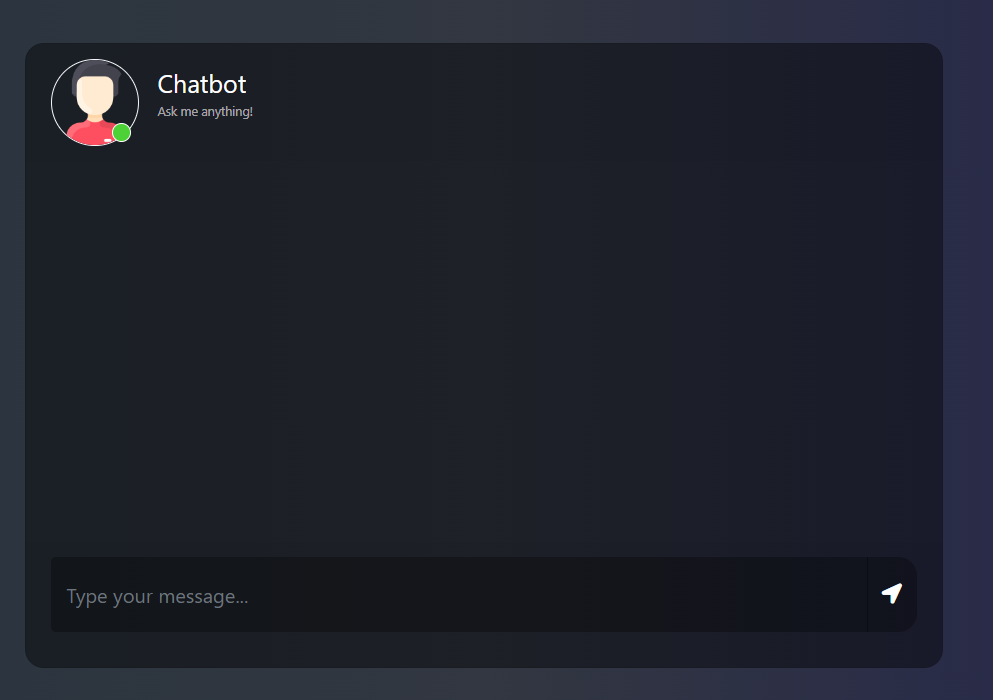

# Medical Chatbot with Generative AI


## Project Description

This project is an end-to-end medical chatbot powered by Generative AI. The chatbot is designed to assist users with medical-related queries by leveraging advanced natural language processing (NLP) techniques. It uses a combination of Pinecone for vector storage, OpenAI for language generation, and various other technologies to provide accurate and concise answers to user questions.

### Technologies Used

- **Python**: The core programming language used for development.
- **Flask**: A lightweight WSGI web application framework for serving the chatbot.
- **Pinecone**: A vector database for storing and querying embeddings.
- **OpenAI**: For generating responses to user queries.
- **LangChain**: For managing the interaction between the chatbot and the vector database.
- **Hugging Face Transformers**: For embedding generation.
- **Bootstrap**: For responsive and modern UI design.
- **jQuery**: For handling AJAX requests and DOM manipulation.

## Screenshot



## How to Run/Use This Project

### Steps:

1. **Clone the Repository**

    ```bash
    git clone https://github.com/Rayyan9477/End-to-End-Medical-Chatbot-Gen-AI.git
    cd End-to-End-Medical-Chatbot-Gen-AI
    ```

2. **Create a Conda Environment**

    ```bash
    conda create -n medibot python=3.12 -y
    conda activate medibot
    ```

3. **Install Dependencies**

    ```bash
    pip install -r requirements.txt
    ```

4. **Set Up Environment Variables**

    Replace the placeholder API keys in the `app.py` and `store_index.py` files

    ```
    PINECONE_API_KEY=your_pinecone_api_key
    OPENAI_API_KEY=your_openai_api_key
    ```

5. **Run the Application**

    ```bash
    python app.py
    ```

6. **Access the Chatbot**

    Open your web browser and go to `http://localhost:8080` to start using the chatbot.

## Replace API Keys

Replace the placeholder API keys in the `app.py` file

```
PINECONE_API_KEY=your_pinecone_api_key
OPENAI_API_KEY=your_openai_api_key
```

## Contact Me

- **GitHub**: [Rayyan9477](https://github.com/Rayyan9477)
- **LinkedIn**: [Rayyan Ahmed](https://www.linkedin.com/in/rayyan-ahmed9477/)
- **Email**: [rayyanahmed265@yahoo.com](mailto:rayyanahmed265@yahoo.com)
